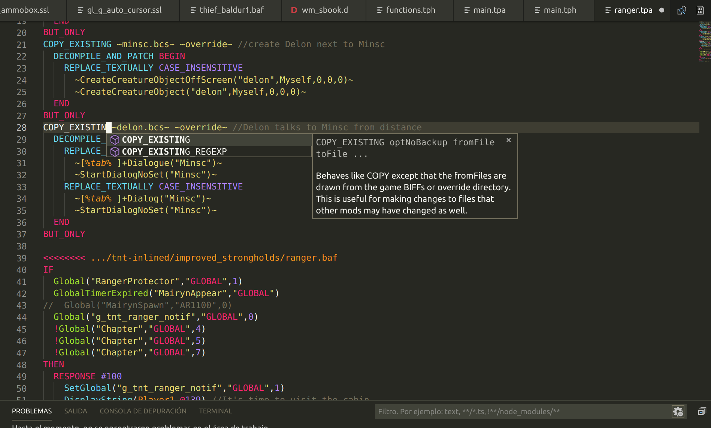

## BGforge multilanguage server

[__Features__](#features)
 | [__Settings__](#settings)
 | [__Installation__](#installation)
 | [__Forum__](https://forum.bgforge.net/viewforum.php?f=35)
 | [__Discord__](https://discord.gg/4Yqfggm)
 | [__Screenshots__](#screenshots)

BGforge MLS is a VScode extension adding support for Star-Trek Scripting Language used in Fallout 1 and 2 games, and several file formats (.d, .baf, .tp2) used by WeiDU, an Infinity Engine games modding utility.

### Features

* Syntax highlighting
* Completion
* Hovers
* Signature help
* Diagnostics

### Settings

This extension contributes the following settings:

* `bgforge.fallout-ssl.compile`: Path to Fallout SSL compile.exe plus compilation options.
* `bgforge.fallout-ssl.output_directory`:  Where to put the compiled Fallout SSL scripts. Absolute path or relative to source directory.
* `bgforge.fallout-ssl.headers_directory`: Absolute path to directory containing Fallout headers, searched recursively.
* `bgforge.weidu.path`: Full path to WeiDU binary

### Hotkeys
* `CTRL+R`: compile (Fallout SSL) or parse (WeiDU .tp2) file, reporting errors if any.

### Installation
Search for BGforge in VScode marketplace, like any other extension. Alternatively, download the packages from releases tab and install it manually.

### Release Notes
See [changelog](CHANGELOG.md).

### Screenshots
Highligting and completion example:

