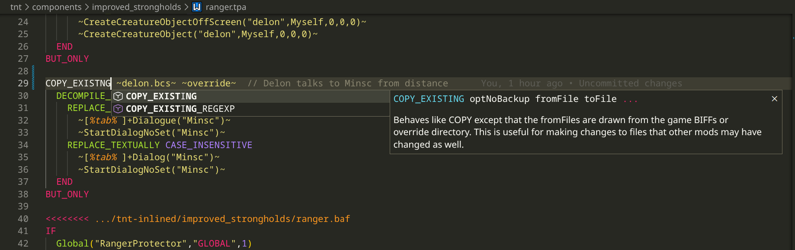
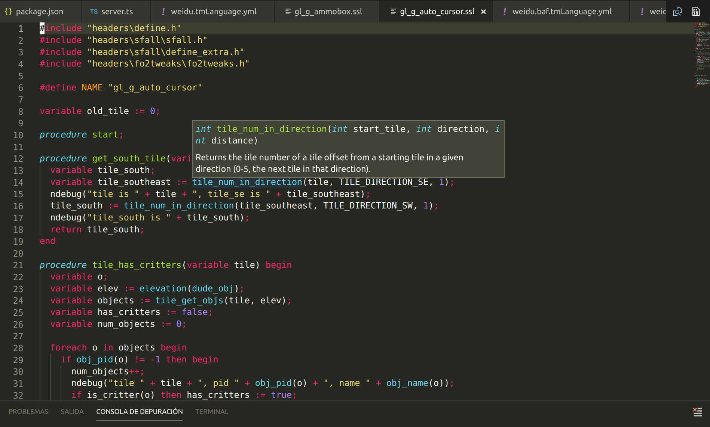
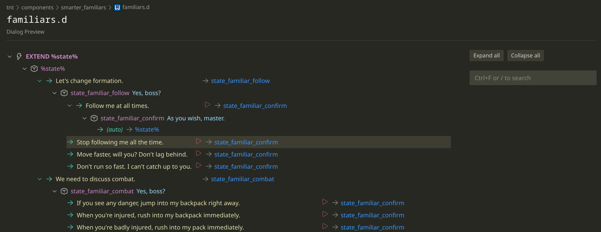
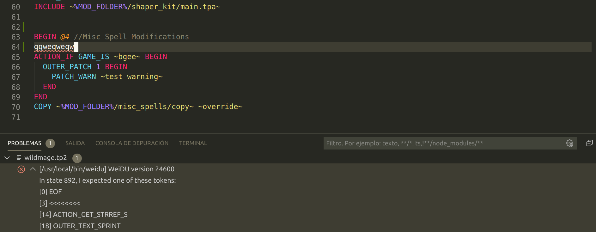

# BGforge multi-language server

BGforge MLS is a collection of tools for working with classic RPG modding languages and file formats. It supports [Star-Trek Scripting Language](https://falloutmods.fandom.com/wiki/Fallout_1_and_Fallout_2_scripting_-_commands,_reference,_tutorials) (`.ssl`) used in Fallout 1 and 2, several [WeiDU](https://weidu.org/~thebigg/README-WeiDU.html) and [Infinity Engine](https://iesdp.bgforge.net) formats (`.d`, `.baf`, `.tp2`, `.tra`, `.2da`), [Sword Coast Stratagems Scripting Language](https://www.gibberlings3.net/forums/topic/13725-coding-scripts-in-ssl-some-lessons/) (`.ssl`, `.slb`), and the TypeScript-based transpilers [TSSL](https://forums.bgforge.net/viewtopic.php?p=2574), [TBAF](https://forums.bgforge.net/viewtopic.php?t=448), and [TD](https://forums.bgforge.net/viewtopic.php?t=1333).

Originally a VS Code extension, it now also works with various other editors. Setup guides are available for [Sublime](docs/editors/sublime-text.md), [Neovim](docs/editors/neovim.md), [Emacs](docs/editors/emacs.md), [JetBrains](docs/editors/jetbrains.md), [Helix](docs/editors/helix.md), [Zed](docs/editors/zed.md), [Kate](docs/editors/kate.md), [Notepad++](docs/editors/notepadpp.md), and [Geany](docs/editors/geany.md). Standalone LSP server is [published](https://www.npmjs.com/package/@bgforge/mls-server) in NPM.

- [**Languages**](#languages): Fallout SSL; WeiDU BAF, D, TP2.
- [**Transpilers**](#transpilers): TSSL, TBAF, TD.
- [**Other formats**](#other-formats): TRA, MSG, 2DA, Fallout PRO, worldmap.txt and scripts.lst.
- [**Installation**](#installation)
- [**Hotkeys**](#hotkeys)
- **Screenshots**: [completion](#infinity-engine-highlighting-and-completion), [hover](#fallout-highlighting-and-hovers), [error reporting](#error-reporting), [dialog tree preview](#dialog-tree-preview).
- [**Forum**](https://forums.bgforge.net/viewforum.php?f=35)

## Languages

| Feature | Fallout SSL | WeiDU BAF | WeiDU SSL | WeiDU D | WeiDU TP2 |
| ------- | :---------: | :-------: | :-------: | :-----: | :-------: |
| Extensions | `.ssl`, `.h` | `.baf` | `.slb`, `.ssl` | `.d` | `.tp2`, `.tpa`, `.tph`, `.tpp` |
| Completion | ✓ | ✓ | ✓ | ✓ | ✓ |
| Hover | ✓ | ✓ | ✓ | ✓ | ✓ |
| Signature help | ✓ |  |  |  |  |
| Go to definition | ✓ |  |  | ✓ | ✓ |
| Find references | ✓ |  |  | ✓ | ✓ |
| Formatting | ✓ | ✓ | ✓ | ✓ | ✓ |
| Document symbols | ✓ |  |  | ✓ | ✓ |
| Workspace symbols | ✓ |  |  |  | ✓ |
| Semantic tokens | ✓ |  |  |  | ✓ |
| Rename | ✓ |  |  | ✓ | Same file |
| Inlay hints | `.msg` | `.tra` | `.tra` | `.tra` | `.tra` |
| Diagnostics | ✓ | ✓ | ✓ | ✓ | ✓ |
| JSDoc | ✓ |  |  | ✓ | ✓ |
| Folding | ✓ | ✓ | ✓ | ✓ | ✓ |
| Dialog preview | ✓ |  |  | ✓ |  |

## Transpilers

These are TypeScript-like language subsets that compile to the scripting formats above.

They bring the TypeScript type system, many TypeScript features, and better tooling to modding.

| Transpiler | Extension | Target | Inlay Hints | Dialog Preview |
| ---------- | --------- | ------ | :---------: | :------------: |
| TSSL       | .tssl     | .ssl   |    .msg     |       ✓        |
| TBAF       | .tbaf     | .baf   |    .tra     |                |
| TD         | .td       | .d     |    .tra     |       ✓        |

**[TSSL](transpilers/tssl/README.md)** (.tssl) compiles to Fallout SSL. Companion project: [FOlib](https://github.com/BGforgeNet/folib).

**[TBAF](transpilers/tbaf/README.md)** (.tbaf) compiles to WeiDU BAF. Important additions include functions, loops, variables, arrays, enums. Companion project: [IETS](https://github.com/BGforgeNet/iets).

**[TD](transpilers/td/README.md)** (.td) compiles to WeiDU D. Same features as TBAF, but has different structure. Also uses IETS.

## Other formats

| Format              | Extensions  | Support               |
| ------------------- | ----------- | --------------------- |
| Fallout worldmap    | worldmap.txt | Completion, hover, syntax highlighting |
| Fallout MSG         | .msg        | Syntax highlighting   |
| Fallout scripts.lst | scripts.lst | Syntax highlighting   |
| Fallout PRO         | .pro        | Binary viewer         |
| WeiDU TRA           | .tra        | Syntax highlighting   |
| Infinity 2DA        | .2da        | Syntax highlighting   |

## Installation

1. Install BGforge MLS from the VS Code Marketplace.
   Alternatively, download the package from [GitHub Releases](https://github.com/BGforgeNet/BGforge-MLS/releases) and install it manually.
1. Check [general settings](docs/settings.md).
1. Check [file associations](docs/file_associations.md).
1. Check [hotkeys](#hotkeys).
1. Enable [custom theme](docs/theme.md) and [icon theme](docs/icon-theme.md).
1. (Infinity Engine) Install [IElib](https://ielib.bgforge.net).

## Hotkeys

- `CTRL+R`: compile a Fallout `.ssl` file or parse a WeiDU file, reporting [errors](#error-reporting) if any.
- `CTRL+SHIFT+V`: open [dialog tree preview](#dialog-tree-preview) (SSL, TSSL, D, TD files).
- Standard VS Code hotkeys:
  - `CTRL+SHIFT+O`: document symbols
  - `CTRL+T`: workspace symbols

## Screenshots

### Infinity Engine highlighting and completion

### Fallout highlighting and hovers

### Dialog tree preview

Visual dialog tree for SSL, TSSL, D, and TD files. Open with `CTRL+SHIFT+V` or the command palette. Shows states, transitions, and resolved translation strings.

### Error reporting

